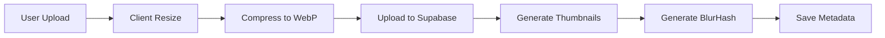

# 📋 BỘ TÀI LIỆU DỰ ÁN: COMPANY MEMORY TIMELINE

## 🎯 EXECUTIVE SUMMARY

**Tên dự án:** Company Memory Timeline  
**Mục tiêu:** Xây dựng nền tảng timeline kỷ niệm công ty với trải nghiệm mobile-first xuất sắc  
**Tech Stack:** Next.js 14 + Supabase + Vercel  
**Target:** 70-80% mobile users, 20-30% desktop  
**Core Value:** Trải nghiệm xem/upload ảnh mượt mà, cảm xúc, dễ sử dụng

---

## 📱 PART 1: MOBILE-FIRST UX/UI SPECIFICATION

### 1.1 Thiết Kế Tương Tác (Interaction Design)

#### **Touch Gestures - Bắt Buộc Implement**

Dựa trên research từ các best practices về gestures trong mobile UX design, đây là danh sách gestures cần thiết:

```javascript
// PRIORITY GESTURES (Must-have)
1. SWIPE LEFT/RIGHT (Gallery Navigation)
   - Trong lightbox: chuyển ảnh tiếp/trước
   - Trong grid: không dùng (tránh conflict với browser)
   - Implement: Hammer.js hoặc native Touch Events

2. PINCH TO ZOOM (Image Detail)
   - Zoom in/out ảnh trong lightbox
   - Phải support: 1x - 5x zoom
   - Reset zoom khi đóng ảnh

3. TAP (Selection)
   - Single tap: mở lightbox
   - Double tap: zoom 2x vào vị trí tap
   - Long press: show context menu (download, share)

4. PULL DOWN (Close Lightbox)
   - Kéo xuống >100px: đóng lightbox với animation
   - Visual feedback: ảnh nhỏ dần theo finger

5. VERTICAL SCROLL (Browse Gallery)
   - Infinite scroll với lazy loading
   - Pull-to-refresh ở top để load ảnh mới
```

**Implementation với Hammer.js:**
```javascript
import Hammer from 'hammerjs';

// Trong Lightbox component
useEffect(() => {
  const hammer = new Hammer(imageRef.current);
  
  hammer.get('pinch').set({ enable: true });
  hammer.get('swipe').set({ direction: Hammer.DIRECTION_HORIZONTAL });
  
  hammer.on('swipeleft', () => goToNextImage());
  hammer.on('swiperight', () => goToPrevImage());
  hammer.on('pinch', (e) => handleZoom(e.scale));
  
  return () => hammer.destroy();
}, []);
```

#### **Visual Feedback - Critical cho UX**

Feedback là yếu tố quan trọng để xác nhận hành động đã hoàn thành:

```typescript
// Feedback types cần implement
interface FeedbackConfig {
  // Visual
  rippleEffect: boolean;        // Khi tap vào ảnh
  scaleAnimation: boolean;       // Hover/press scale 1.05x
  loadingSpinner: boolean;       // Khi upload/load
  
  // Haptic (mobile only)
  vibrationOnAction: boolean;    // Khi delete, save
  
  // Toast notifications
  uploadSuccess: string;
  uploadError: string;
  copyLinkSuccess: string;
}
```

### 1.2 Responsive Layout Strategy

#### **Breakpoints & Layout**

```css
/* Mobile First approach */
/* Base: Mobile (375px - 767px) */
.gallery-grid {
  grid-template-columns: repeat(2, 1fr);
  gap: 8px;
  padding: 12px;
}

/* Tablet (768px - 1023px) */
@media (min-width: 768px) {
  .gallery-grid {
    grid-template-columns: repeat(3, 1fr);
    gap: 12px;
    padding: 16px;
  }
}

/* Desktop (1024px+) */
@media (min-width: 1024px) {
  .gallery-grid {
    grid-template-columns: repeat(4, 1fr);
    gap: 16px;
    padding: 24px;
  }
}
```

#### **Typography Scale (Mobile-First)**

```typescript
// Sử dụng clamp() cho fluid typography
const typography = {
  h1: 'clamp(2rem, 5vw, 3rem)',      // 32px - 48px
  h2: 'clamp(1.5rem, 4vw, 2rem)',    // 24px - 32px
  body: 'clamp(0.875rem, 2vw, 1rem)', // 14px - 16px
  caption: 'clamp(0.75rem, 1.5vw, 0.875rem)' // 12px - 14px
}
```

### 1.3 Performance Optimization (Mobile Focus)

#### **Image Loading Strategy**

Dựa trên Next.js 14 image optimization best practices:

```typescript
// Image component configuration
import Image from 'next/image';

const GalleryImage = ({ photo }) => (
  <Image
    src={photo.url}
    alt={photo.alt}
    fill
    sizes="(max-width: 768px) 50vw, (max-width: 1024px) 33vw, 25vw"
    placeholder="blur"
    blurDataURL={photo.blurHash} // Generate với blurhash
    loading="lazy"
    quality={85} // 85% quality = sweet spot
    onLoadingComplete={() => setImageLoaded(true)}
  />
);
```

#### **Image Optimization Pipeline**



**Code Implementation:**

```typescript
// Client-side resize TRƯỚC khi upload
import imageCompression from 'browser-image-compression';

async function handleImageUpload(file: File) {
  // 1. Resize & compress
  const options = {
    maxSizeMB: 2,              // Max 2MB
    maxWidthOrHeight: 1920,    // Full HD max
    useWebWorker: true,
    fileType: 'image/webp'     // Force WebP
  };
  
  const compressedFile = await imageCompression(file, options);
  
  // 2. Generate thumbnail (300px width)
  const thumbnailOptions = { ...options, maxWidthOrHeight: 300 };
  const thumbnail = await imageCompression(file, thumbnailOptions);
  
  // 3. Generate blur hash cho placeholder
  const blurHash = await generateBlurHash(compressedFile);
  
  // 4. Upload to Supabase
  return { compressedFile, thumbnail, blurHash };
}
```

#### **Lazy Loading & Infinite Scroll**

```typescript
import { useInView } from 'react-intersection-observer';

const PhotoGrid = ({ photos }) => {
  const [visiblePhotos, setVisiblePhotos] = useState(20);
  const { ref, inView } = useInView({ threshold: 0.5 });
  
  useEffect(() => {
    if (inView && visiblePhotos < photos.length) {
      setVisiblePhotos(prev => prev + 20);
    }
  }, [inView]);
  
  return (
    <Masonry>
      {photos.slice(0, visiblePhotos).map((photo, i) => (
        <PhotoItem key={photo.id} photo={photo} />
      ))}
      <div ref={ref} />
    </Masonry>
  );
};
```

---

## 🏗️ PART 2: TECHNICAL ARCHITECTURE

### 2.1 Tech Stack Chi Tiết

```yaml
Frontend:
  Framework: Next.js 14.2+ (App Router)
  Language: TypeScript 5.0+
  Styling: Tailwind CSS 3.4+
  UI Components: shadcn/ui
  State Management: Zustand (nhẹ hơn Redux)
  
Image Handling:
  Display: next/image với custom loader
  Masonry: react-masonry-css
  Lightbox: yet-another-react-lightbox v3.25+
  Compression: browser-image-compression
  BlurHash: blurhash + sharp
  
Backend:
  Database: Supabase PostgreSQL
  Storage: Supabase Storage
  Auth: Supabase Auth (Magic Link)
  Realtime: Supabase Realtime (optional)
  
Deployment:
  Platform: Vercel (Edge Network)
  CDN: Vercel CDN + Supabase CDN
  Analytics: Vercel Analytics
```

### 2.2 Database Schema (Supabase PostgreSQL)

```sql
-- 1. EVENTS TABLE
CREATE TABLE events (
  id UUID PRIMARY KEY DEFAULT gen_random_uuid(),
  title VARCHAR(255) NOT NULL,
  description TEXT,
  slug VARCHAR(255) UNIQUE NOT NULL,
  
  -- Dates
  event_date DATE NOT NULL,
  start_date TIMESTAMP WITH TIME ZONE NOT NULL,
  end_date TIMESTAMP WITH TIME ZONE,
  
  -- Status
  status VARCHAR(20) DEFAULT 'draft' CHECK (status IN ('draft', 'open', 'closed', 'archived')),
  allow_upload BOOLEAN DEFAULT true,
  allow_wishes BOOLEAN DEFAULT true,
  
  -- Metadata
  cover_image_url TEXT,
  total_photos INTEGER DEFAULT 0,
  total_videos INTEGER DEFAULT 0,
  total_contributors INTEGER DEFAULT 0,
  
  created_at TIMESTAMP WITH TIME ZONE DEFAULT NOW(),
  updated_at TIMESTAMP WITH TIME ZONE DEFAULT NOW()
);

-- 2. POSTS TABLE (Photos/Videos)
CREATE TABLE posts (
  id UUID PRIMARY KEY DEFAULT gen_random_uuid(),
  event_id UUID REFERENCES events(id) ON DELETE CASCADE,
  user_id UUID REFERENCES auth.users(id) ON DELETE SET NULL,
  
  -- Media
  media_type VARCHAR(10) CHECK (media_type IN ('image', 'video')),
  media_url TEXT NOT NULL,           -- Full size URL
  thumbnail_url TEXT,                -- Thumbnail 300px
  blurhash VARCHAR(50),              -- Placeholder blur
  
  -- Dimensions
  width INTEGER,
  height INTEGER,
  file_size INTEGER,                 -- bytes
  
  -- Content
  wish_text TEXT,
  
  -- Metadata
  uploaded_at TIMESTAMP WITH TIME ZONE DEFAULT NOW(),
  view_count INTEGER DEFAULT 0,
  
  -- Moderation (future)
  status VARCHAR(20) DEFAULT 'approved' CHECK (status IN ('pending', 'approved', 'rejected'))
);

-- 3. USERS TABLE (Extended profile)
CREATE TABLE user_profiles (
  id UUID PRIMARY KEY REFERENCES auth.users(id),
  full_name VARCHAR(255),
  email VARCHAR(255),
  avatar_url TEXT,
  total_uploads INTEGER DEFAULT 0,
  created_at TIMESTAMP WITH TIME ZONE DEFAULT NOW()
);

-- INDEXES for Performance
CREATE INDEX idx_posts_event_id ON posts(event_id);
CREATE INDEX idx_posts_uploaded_at ON posts(uploaded_at DESC);
CREATE INDEX idx_events_status ON events(status);
CREATE INDEX idx_events_slug ON events(slug);

-- TRIGGERS để auto-update counts
CREATE OR REPLACE FUNCTION update_event_stats()
RETURNS TRIGGER AS $$
BEGIN
  IF TG_OP = 'INSERT' THEN
    UPDATE events SET
      total_photos = total_photos + (CASE WHEN NEW.media_type = 'image' THEN 1 ELSE 0 END),
      total_videos = total_videos + (CASE WHEN NEW.media_type = 'video' THEN 1 ELSE 0 END),
      updated_at = NOW()
    WHERE id = NEW.event_id;
  END IF;
  RETURN NEW;
END;
$$ LANGUAGE plpgsql;

CREATE TRIGGER update_event_stats_trigger
AFTER INSERT ON posts
FOR EACH ROW EXECUTE FUNCTION update_event_stats();
```

### 2.3 Supabase Storage Setup

```sql
-- STORAGE BUCKETS
-- 1. Create 'photos' bucket (Public)
INSERT INTO storage.buckets (id, name, public) 
VALUES ('photos', 'photos', true);

-- 2. Create 'videos' bucket (Public) - optional phase 2
INSERT INTO storage.buckets (id, name, public) 
VALUES ('videos', 'videos', true);

-- ROW LEVEL SECURITY POLICIES
-- Allow authenticated users to upload
CREATE POLICY "Authenticated users can upload photos"
ON storage.objects FOR INSERT
TO authenticated
WITH CHECK (bucket_id = 'photos');

-- Allow everyone to view photos (public event)
CREATE POLICY "Public can view photos"
ON storage.objects FOR SELECT
TO public
USING (bucket_id = 'photos');

-- Only owner can delete their photos
CREATE POLICY "Users can delete own photos"
ON storage.objects FOR DELETE
TO authenticated
USING (bucket_id = 'photos' AND auth.uid() = owner);
```

### 2.4 Upload Flow Implementation

```typescript
// app/api/upload/route.ts
import { createRouteHandlerClient } from '@supabase/auth-helpers-nextjs';
import { NextRequest, NextResponse } from 'next/server';
import { nanoid } from 'nanoid';

export async function POST(request: NextRequest) {
  const supabase = createRouteHandlerClient({ cookies });
  
  // 1. Verify auth
  const { data: { user } } = await supabase.auth.getUser();
  if (!user) {
    return NextResponse.json({ error: 'Unauthorized' }, { status: 401 });
  }
  
  const formData = await request.formData();
  const file = formData.get('file') as File;
  const eventId = formData.get('eventId') as string;
  const wishText = formData.get('wishText') as string;
  
  // 2. Validate file
  if (!file || file.size > 5 * 1024 * 1024) { // 5MB limit
    return NextResponse.json({ error: 'Invalid file' }, { status: 400 });
  }
  
  // 3. Generate unique filename
  const fileExt = file.name.split('.').pop();
  const fileName = `${eventId}/${nanoid()}.${fileExt}`;
  
  // 4. Upload to Supabase Storage
  const { data: uploadData, error: uploadError } = await supabase.storage
    .from('photos')
    .upload(fileName, file, {
      cacheControl: '31536000', // 1 year
      upsert: false
    });
    
  if (uploadError) {
    return NextResponse.json({ error: uploadError.message }, { status: 500 });
  }
  
  // 5. Get public URL
  const { data: { publicUrl } } = supabase.storage
    .from('photos')
    .getPublicUrl(fileName);
  
  // 6. Save metadata to database
  const { data: post, error: dbError } = await supabase
    .from('posts')
    .insert({
      event_id: eventId,
      user_id: user.id,
      media_type: 'image',
      media_url: publicUrl,
      wish_text: wishText,
      // Add dimensions, blurhash later
    })
    .select()
    .single();
    
  return NextResponse.json({ data: post });
}
```

---

## 🎨 PART 3: UI/UX COMPONENTS IMPLEMENTATION

### 3.1 Masonry Grid Component

Sử dụng react-masonry-css cho masonry layout:

```typescript
// components/PhotoGrid.tsx
'use client';

import Masonry from 'react-masonry-css';
import Image from 'next/image';
import { useState } from 'react';
import Lightbox from 'yet-another-react-lightbox';
import 'yet-another-react-lightbox/styles.css';

interface Photo {
  id: string;
  media_url: string;
  thumbnail_url: string;
  blurhash: string;
  wish_text?: string;
  width: number;
  height: number;
}

export const PhotoGrid = ({ photos }: { photos: Photo[] }) => {
  const [lightboxOpen, setLightboxOpen] = useState(false);
  const [currentIndex, setCurrentIndex] = useState(0);
  
  const breakpointColumns = {
    default: 4,
    1024: 3,
    768: 2,
    640: 2
  };
  
  const slides = photos.map(photo => ({
    src: photo.media_url,
    width: photo.width,
    height: photo.height,
    description: photo.wish_text
  }));
  
  return (
    <>
      <Masonry
        breakpointCols={breakpointColumns}
        className="flex gap-4 w-full"
        columnClassName="space-y-4"
      >
        {photos.map((photo, index) => (
          <div
            key={photo.id}
            className="relative cursor-pointer group overflow-hidden rounded-lg"
            onClick={() => {
              setCurrentIndex(index);
              setLightboxOpen(true);
            }}
          >
            <Image
              src={photo.thumbnail_url}
              alt={photo.wish_text || 'Photo'}
              width={300}
              height={300}
              className="w-full h-auto transition-transform duration-300 group-hover:scale-105"
              placeholder="blur"
              blurDataURL={photo.blurhash}
            />
            
            {/* Hover Overlay */}
            <div className="absolute inset-0 bg-black/0 group-hover:bg-black/30 transition-all duration-300">
              {photo.wish_text && (
                <p className="absolute bottom-0 left-0 right-0 p-4 text-white opacity-0 group-hover:opacity-100 transition-opacity line-clamp-3">
                  {photo.wish_text}
                </p>
              )}
            </div>
          </div>
        ))}
      </Masonry>
      
      <Lightbox
        open={lightboxOpen}
        close={() => setLightboxOpen(false)}
        slides={slides}
        index={currentIndex}
        // Plugins
        plugins={[Zoom, Captions]}
        // Mobile gestures
        carousel={{
          finite: false,
          preload: 2
        }}
        controller={{
          closeOnPullDown: true,
          closeOnBackdropClick: true
        }}
      />
    </>
  );
};
```

### 3.2 Upload Component (Multi-file với Progress)

```typescript
// components/UploadZone.tsx
'use client';

import { useCallback, useState } from 'react';
import { useDropzone } from 'react-dropzone';
import { Upload, X, CheckCircle } from 'lucide-react';

interface UploadFile {
  file: File;
  preview: string;
  progress: number;
  status: 'pending' | 'uploading' | 'done' | 'error';
}

export const UploadZone = ({ eventId }: { eventId: string }) => {
  const [files, setFiles] = useState<UploadFile[]>([]);
  
  const onDrop = useCallback((acceptedFiles: File[]) => {
    const newFiles = acceptedFiles.map(file => ({
      file,
      preview: URL.createObjectURL(file),
      progress: 0,
      status: 'pending' as const
    }));
    setFiles(prev => [...prev, ...newFiles]);
  }, []);
  
  const { getRootProps, getInputProps, isDragActive } = useDropzone({
    onDrop,
    accept: { 'image/*': ['.jpg', '.jpeg', '.png', '.webp'] },
    maxSize: 5 * 1024 * 1024, // 5MB
    multiple: true
  });
  
  const uploadFile = async (index: number) => {
    const fileData = files[index];
    const formData = new FormData();
    formData.append('file', fileData.file);
    formData.append('eventId', eventId);
    
    try {
      // Update status
      setFiles(prev => prev.map((f, i) => 
        i === index ? { ...f, status: 'uploading' } : f
      ));
      
      const xhr = new XMLHttpRequest();
      
      xhr.upload.addEventListener('progress', (e) => {
        if (e.lengthComputable) {
          const progress = (e.loaded / e.total) * 100;
          setFiles(prev => prev.map((f, i) => 
            i === index ? { ...f, progress } : f
          ));
        }
      });
      
      xhr.addEventListener('load', () => {
        setFiles(prev => prev.map((f, i) => 
          i === index ? { ...f, status: 'done', progress: 100 } : f
        ));
      });
      
      xhr.open('POST', '/api/upload');
      xhr.send(formData);
    } catch (error) {
      setFiles(prev => prev.map((f, i) => 
        i === index ? { ...f, status: 'error' } : f
      ));
    }
  };
  
  const uploadAll = () => {
    files.forEach((_, i) => {
      if (files[i].status === 'pending') {
        uploadFile(i);
      }
    });
  };
  
  return (
    <div className="space-y-4">
      {/* Dropzone */}
      <div
        {...getRootProps()}
        className={`
          border-2 border-dashed rounded-lg p-8 text-center cursor-pointer
          transition-colors duration-200
          ${isDragActive ? 'border-blue-500 bg-blue-50' : 'border-gray-300 hover:border-gray-400'}
        `}
      >
        <input {...getInputProps()} />
        <Upload className="mx-auto h-12 w-12 text-gray-400 mb-4" />
        <p className="text-sm text-gray-600">
          Kéo thả ảnh vào đây hoặc click để chọn
        </p>
        <p className="text-xs text-gray-500 mt-2">
          Tối đa 5MB mỗi ảnh • JPG, PNG, WebP
        </p>
      </div>
      
      {/* File List */}
      {files.length > 0 && (
        <div className="space-y-2">
          {files.map((file, i) => (
            <div key={i} className="flex items-center gap-3 p-3 bg-gray-50 rounded-lg">
              
              <div className="flex-1">
                <p className="text-sm font-medium truncate">{file.file.name}</p>
                {file.status === 'uploading' && (
                  <div className="w-full bg-gray-200 rounded-full h-2 mt-1">
                    <div 
                      className="bg-blue-500 h-2 rounded-full transition-all"
                      style={{ width: `${file.progress}%` }}
                    />
                  </div>
                )}
              </div>
              {file.status === 'done' && <CheckCircle className="text-green-500" />}
              {file.status === 'error' && <X className="text-red-500" />}
            </div>
          ))}
          
          <button
            onClick={uploadAll}
            className="w-full py-2 bg-blue-500 text-white rounded-lg hover:bg-blue-600"
          >
            Upload tất cả ({files.filter(f => f.status === 'pending').length})
          </button>
        </div>
      )}
    </div>
  );
};
```

### 3.3 Timeline Navigation Component

```typescript
// components/TimelineNav.tsx
'use client';

import { format } from 'date-fns';
import { vi } from 'date-fns/locale';
import { Calendar } from 'lucide-react';

interface Event {
  id: string;
  title: string;
  slug: string;
  event_date: string;
  total_photos: number;
  cover_image_url?: string;
}

export const TimelineNav = ({ events }: { events: Event[] }) => {
  return (
    <div className="relative py-8">
      {/* Timeline Line */}
      <div className="absolute top-12 left-0 right-0 h-0.5 bg-gradient-to-r from-blue-500 via-purple-500 to-pink-500" />
      
      {/* Events */}
      <div className="relative flex overflow-x-auto gap-8 pb-4 snap-x snap-mandatory">
        {events.map((event) => (
          
            key={event.id}
            href={`/events/${event.slug}`}
            className="flex-shrink-0 snap-center group"
          >
            <div className="relative">
              {/* Dot on timeline */}
              <div className="absolute -top-12 left-1/2 -translate-x-1/2 w-4 h-4 bg-white border-4 border-blue-500 rounded-full group-hover:scale-125 transition-transform z-10" />
              
              {/* Event Card */}
              <div className="w-48 bg-white rounded-xl shadow-lg overflow-hidden group-hover:shadow-xl transition-shadow">
                {event.cover_image_url && (
                  
                )}
                <div className="p-4">
                  <div className="flex items-center gap-2 text-sm text-gray-500 mb-2">
                    <Calendar className="w-4 h-4" />
                    <span>
                      {format(new Date(event.event_date), 'dd/MM/yyyy', { locale: vi })}
                    </span>
                  </div>
                  <h3 className="font-semibold text-gray-900 mb-2">
                    {event.title}
                  </h3>
                  <p className="text-sm text-gray-600">
                    {event.total_photos} ảnh
                  </p>
                </div>
              </div>
            </div>
          </a>
        ))}
      </div>
    </div>
  );
};
```

---

## 📋 PART 4: IMPLEMENTATION ROADMAP

### Phase 1: MVP (Week 1-2) - Core Features

```markdown
✅ WEEK 1: Foundation
□ Day 1-2: Setup
  - Initialize Next.js 14 project
  - Setup Supabase (database + storage)
  - Configure Tailwind + shadcn/ui
  - Setup authentication (Magic Link)
  
□ Day 3-4: Database & Schema
  - Create tables (events, posts, user_profiles)
  - Setup RLS policies
  - Create storage buckets
  - Test CRUD operations
  
□ Day 5-7: Basic UI
  - Homepage với timeline navigation
  - Event page với masonry grid
  - Basic lightbox integration
  - Mobile responsive layout

✅ WEEK 2: Upload & Polish
□ Day 8-10: Upload System
  - Upload component với drag & drop
  - Client-side image compression
  - Progress tracking
  - Error handling
  
□ Day 11-12: Performance
  - Implement lazy loading
  - Add blur placeholders
  - Optimize Next.js Image
  - Test on mobile devices
  
□ Day 13-14: Testing & Deploy
  - E2E testing (Playwright)
  - Mobile UX testing
  - Deploy to Vercel
  - Setup analytics
```

### Phase 2: Enhanced UX (Week 3-4) - Nice-to-have

```markdown
✅ WEEK 3: Advanced Features
□ Wish text với rich formatting
□ Download album (ZIP export)
□ Share individual photos
□ Stats page (analytics dashboard)
□ Search & filter

✅ WEEK 4: Polish & Optimize
□ Micro-interactions (animations)
□ Haptic feedback
□ Dark mode
□ PWA support
□ Performance monitoring
```

### Phase 3: Future Enhancements (Optional)

```markdown
🔮 FUTURE IDEAS:
□ Video support (với Cloudflare Stream)
□ Real-time updates (Supabase Realtime)
□ Comments on photos
□ Reactions (like, love, wow)
□ Admin dashboard với moderation
□ Memory Map (geolocation)
□ AI-powered search (tags, faces)
□ Slideshow generator
```

---

## 🧪 PART 5: TESTING & QUALITY ASSURANCE

### 5.1 Testing Checklist

```markdown
## MOBILE TESTING (Priority)
### iOS Safari
□ Touch gestures hoạt động mượt mà
□ Pinch zoom không lag
□ Scroll performance >60fps
□ Image loading nhanh (<2s)
□ Không có layout shift

### Android Chrome
□ Swipe gestures không conflict với browser
□ Back button behavior đúng
□ Upload từ camera/gallery
□ Không có memory leak
□ Offline handling

### Cross-device
□ iPhone SE (375px) - smallest
□ iPhone 12/13 (390px)
□ iPhone 14 Pro Max (430px)
□ Samsung Galaxy S21 (360px)
□ iPad (768px)

## PERFORMANCE METRICS
□ Lighthouse Score:
  - Performance: >90
  - Accessibility: >95
  - Best Practices: >90
  - SEO: >90

□ Core Web Vitals:
  - LCP: <2.5s
  - FID: <100ms
  - CLS: <0.1

□ Image Loading:
  - Blur placeholder: instant
  - Thumbnail: <1s
  - Full size: <3s
```

### 5.2 Browser Compatibility Matrix

```
✅ Fully Supported:
- Chrome 100+
- Safari 15+
- Firefox 100+
- Edge 100+
- Mobile Safari (iOS 15+)
- Mobile Chrome (Android 10+)

⚠️ Limited Support (graceful degradation):
- Safari 14 (no WebP)
- Older Android browsers

❌ Not Supported:
- IE11
- Opera Mini
```

---

## 📊 PART 6: PERFORMANCE MONITORING

### 6.1 Setup Vercel Analytics

```typescript
// app/layout.tsx
import { Analytics } from '@vercel/analytics/react';
import { SpeedInsights } from '@vercel/speed-insights/next';

export default function RootLayout({ children }) {
  return (
    <html>
      <body>
        {children}
        <Analytics />
        <SpeedInsights />
      </body>
    </html>
  );
}
```

### 6.2 Custom Metrics Tracking

```typescript
// lib/analytics.ts
export const trackEvent = (eventName: string, properties?: Record<string, any>) => {
  // Track user interactions
  if (typeof window !== 'undefined') {
    window.gtag?.('event', eventName, properties);
  }
};

// Usage examples:
trackEvent('photo_viewed', { eventId, photoId });
trackEvent('photo_uploaded', { eventId, fileSize, duration });
trackEvent('lightbox_opened', { eventId, index });
```

---

## 🔐 PART 7: SECURITY BEST PRACTICES

### 7.1 Input Validation

```typescript
// lib/validation.ts
import { z } from 'zod';

export const uploadSchema = z.object({
  file: z
    .instanceof(File)
    .refine(file => file.size <= 5 * 1024 * 1024, 'File tối đa 5MB')
    .refine(
      file => ['image/jpeg', 'image/png', 'image/webp'].includes(file.type),
      'Chỉ chấp nhận JPG, PNG, WebP'
    ),
  eventId: z.string().uuid(),
  wishText: z.string().max(500).optional()
});
```

### 7.2 Rate Limiting

```typescript
// middleware.ts
import { ratelimit } from '@/lib/redis';

export async function middleware(request: NextRequest) {
  const ip = request.ip ?? '127.0.0.1';
  
  // Upload rate limit: 10 requests per minute
  if (request.nextUrl.pathname.startsWith('/api/upload')) {
    const { success } = await ratelimit.limit(ip);
    if (!success) {
      return NextResponse.json(
        { error: 'Too many uploads' },
        { status: 429 }
      );
    }
  }
  
  return NextResponse.next();
}
```

---

## 📝 PART 8: DEPLOYMENT CHECKLIST

```markdown
## PRE-DEPLOYMENT
□ Environment variables setup (.env.production)
  - NEXT_PUBLIC_SUPABASE_URL
  - NEXT_PUBLIC_SUPABASE_ANON_KEY
  - SUPABASE_SERVICE_ROLE_KEY (server-only)

□ Supabase Production Setup
  - Enable RLS on all tables
  - Configure storage policies
  - Setup backup schedule
  - Enable point-in-time recovery

□ Performance Optimization
  - Enable Next.js compression
  - Configure caching headers
  - Setup CDN (Vercel Edge Network)
  - Optimize images (WebP, AVIF)

## DEPLOYMENT
□ Vercel Configuration
  - Set production domain
  - Configure custom domain
  - Enable Edge Functions
  - Setup preview deployments

□ Post-Deployment Testing
  - Run Lighthouse audit
  - Test on real devices
  - Check analytics setup
  - Monitor error tracking (Sentry)

## MAINTENANCE
□ Setup monitoring alerts
□ Configure weekly backups
□ Schedule performance reviews
□ Plan feature updates
```

---

## 🎓 PART 9: DEVELOPER HANDBOOK

### 9.1 Project Structure

```
project-root/
├── app/                    # Next.js 14 App Router
│   ├── (auth)/
│   │   └── login/         # Auth pages
│   ├── events/
│   │   └── [slug]/        # Event detail page
│   ├── upload/            # Upload page
│   ├── api/
│   │   ├── upload/        # Upload API
│   │   └── events/        # Events API
│   ├── layout.tsx
│   └── page.tsx           # Homepage
│
├── components/
│   ├── ui/                # shadcn/ui components
│   ├── PhotoGrid.tsx
│   ├── TimelineNav.tsx
│   └── UploadZone.tsx
│
├── lib/
│   ├── supabase/
│   │   ├── client.ts      # Browser client
│   │   ├── server.ts      # Server client
│   │   └── types.ts       # Database types
│   ├── utils.ts
│   └── validation.ts
│
├── public/
│   └── images/
│
└── styles/
    └── globals.css
```

### 9.2 Code Style Guide

```typescript
// ✅ GOOD: Descriptive names, proper types
interface PhotoGridProps {
  photos: Photo[];
  eventId: string;
  onPhotoClick?: (index: number) => void;
}

export const PhotoGrid = ({ photos, eventId, onPhotoClick }: PhotoGridProps) => {
  // Implementation
};

// ❌ BAD: Generic names, no types
export const Grid = ({ data, id, onClick }) => {
  // Implementation
};
```

### 9.3 Common Patterns

```typescript
// Pattern 1: Server Component with data fetching
// app/events/[slug]/page.tsx
import { createServerComponentClient } from '@supabase/auth-helpers-nextjs';
import { cookies } from 'next/headers';

export default async function EventPage({ params }) {
  const supabase = createServerComponentClient({ cookies });
  
  const { data: event } = await supabase
    .from('events')
    .select('*, posts(*)')
    .eq('slug', params.slug)
    .single();
  
  return <EventDetail event={event} />;
}

// Pattern 2: Client Component with state
// components/PhotoGrid.tsx
'use client';

import { useState } from 'react';

export const PhotoGrid = ({ initialPhotos }) => {
  const [photos, setPhotos] = useState(initialPhotos);
  // ... client logic
};
```

---

## 🎯 KEY SUCCESS METRICS

```yaml
User Experience:
  - Time to First Photo: <2s
  - Upload Success Rate: >98%
  - Mobile Bounce Rate: <30%
  - Average Session Duration: >2min

Technical:
  - Lighthouse Performance: >90
  - Core Web Vitals: All Green
  - Uptime: >99.9%
  - API Response Time: <200ms

Business:
  - Photos Uploaded per Event: >100
  - User Participation Rate: >60%
  - Return Visitor Rate: >40%
```

---

## 📚 ADDITIONAL RESOURCES

### Libraries Documentation
- [Next.js Image Optimization](https://nextjs.org/docs/app/building-your-application/optimizing/images)
- [Supabase Storage Guide](https://supabase.com/docs/guides/storage)
- [yet-another-react-lightbox](https://yet-another-react-lightbox.com/)
- [react-masonry-css](https://www.npmjs.com/package/react-masonry-css)
- [Tailwind CSS](https://tailwindcss.com/docs)

### Learning Materials
- [Mobile UX Design Patterns](https://www.nngroup.com/articles/contextual-swipe/)
- [Web Performance Optimization](https://web.dev/explore/fast)
- [React Best Practices 2024](https://react.dev/learn)

---

## ✅ FINAL CHECKLIST BEFORE LAUNCH

```markdown
□ All pages responsive (mobile, tablet, desktop)
□ Touch gestures working perfectly
□ Image loading optimized (<3s full resolution)
□ Upload flow tested end-to-end
□ Auth working (magic link)
□ Database properly indexed
□ RLS policies configured
□ Error handling comprehensive
□ Analytics tracking setup
□ Performance metrics green
□ Security audit passed
□ Accessibility tested (WCAG AA)
□ Cross-browser tested
□ Production environment variables set
□ Backup strategy in place
□ Monitoring alerts configured
```

---

## 💬 KẾT LUẬN

Tài liệu này đã cover toàn bộ từ **architecture → implementation → deployment**. Điểm mạnh:

✅ **Mobile-first** với touch gestures professional  
✅ **Performance** tối ưu với Next.js + Supabase  
✅ **UX xuất sắc** với masonry + lightbox  
✅ **Scalable** cho nhiều events  
✅ **Ready to code** - có thể bắt đầu implement ngay

**Next Steps:**
1. Review tài liệu này kỹ
2. Setup môi trường dev (Next.js + Supabase)
3. Bắt đầu từ Phase 1 - Week 1
4. Test trên mobile thường xuyên
5. Iterate based on user feedback

Bạn có câu hỏi nào về bất kỳ phần nào trong tài liệu không? Tôi có thể:
- Deep dive vào technical implementation cụ thể
- Code một component mẫu
- Giải thích chi tiết hơn về bất kỳ pattern nào
- Tạo diagram architecture